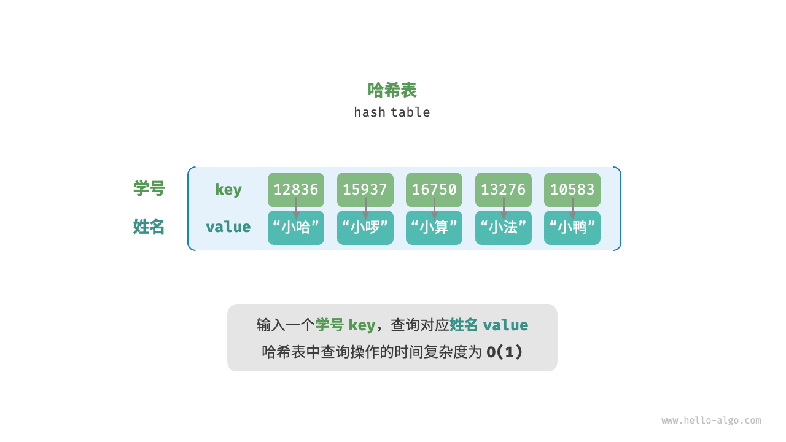

> [!tip]
>
> 参考 [Hello 算法](https://www.hello-algo.com)。

## 栈与队列

### 栈 Stack

栈是一种遵循后进先出（LIFO，Last In First Out）的线性数据结构。将元素添加到栈顶称为 “入栈”，移除栈顶元素称为 “出栈”。栈可以通过 “数组” 或 “链表” 来实现，然而数组和链表可以在任意位置添加或删除元素，但是栈遵循后进先出（或先进后出）的原则，所以**栈可以视为一种受限的数组或链表**。


使用数组实现栈，可以将数组的尾部作为栈顶。入栈就是向数组尾部添加元素，出栈就是删除数组尾部的元素。

```ts
class Stack<T> {
  private readonly stack: T[]
  
  constructor(stack: T[] = []) {
    this.stack = stack
  }
  
  /**
   * 获取栈的值
   */
  get value() {
    return this.stack
  }
  
  /**
   * 获取栈的长度
   */
  get size() {
    return this.stack.length
  }
  
  /**
   * 判断栈是否为空
   */
  isEmpty() {
    return this.stack.length === 0
  }
  
  /**
   * 入栈（向栈顶添加元素）
   * @param value - 入栈的元素
   */
  push(value: T) {
    this.stack.push(value)
  }
  
  /**
   * 出栈（移除栈顶元素）
   */
  pop() {
    return this.stack.pop()
  }
  
  /**
   * 访问栈顶元素
   */
  peek() {
    return this.stack[this.stack.length - 1]
  }
  
  /**
   * 遍历栈
   */
  each(callback: (value: T, index: number) => void) {
    for (let i = 0; i < this.stack.length; i++) {
      callback(this.stack[i], i)
    }
  }
}
```

### 队列 Queue

队列是一种遵循先进先出（FIFO，First In First Out）的线性数据结构。向队尾添加元素称为 “入队”，移除队首元素称为 “出队”。队列也可以通过 “数组” 或 “链表” 来实现，所以**队列也可以视为一种受限的数组或链表**。


使用数组实现队列，可以将数组的尾部作为队尾，将数组的头部作为队首。入队就是向数组尾部添加元素，出队就是移除数组头部的元素。

```ts
class Queue<T> {
  private readonly queue: T[]
  
  constructor(queue: T[] = []) {
    this.queue = queue
  }
  
  /**
   * 获取队列的值
   */
  get value() {
    return this.queue
  }
  
  /**
   * 获取队列的长度
   */
  get size() {
    return this.queue.length
  }
  
  /**
   * 判断队列是否为空
   */
  isEmpty() {
    return this.queue.length === 0
  }
  
  /**
   * 入队（向队尾添加元素）
   * @param value - 入队的元素
   */
  enqueue(value: T) {
    this.queue.push(value)
  }
  
  /**
   * 出队（移除队首元素）
   */
  dequeue() {
    return this.queue.shift()
  }
  
  /**
   * 访问队首元素
   */
  front() {
    return this.queue[0]
  }
  
  /**
   * 遍历队列
   */
  each(callback: (value: T, index: number) => void) {
    for (let i = 0; i < this.queue.length; i++) {
      callback(this.queue[i], i)
    }
  }
}
```

### 优先级队列

优先级队列在插入操作时，需要比较元素的优先级，而不是先进先出，其他操作与普通队列相同。

```ts
class QueueNode<T> {
  value: T
  priority: number
  
  constructor(value: T, priority: number) {
    this.value = value
    this.priority = priority
  }
}

class PriorityQueue<T> extends Queue<QueueNode<T>> {
  constructor() {
    super()
  }
  
  /**
   * 向队列中插入元素
   * @param node - 插入的元素
   */
  enqueue(node: QueueNode<T>) {
    const { value, priority } = node
    const queueNode = new QueueNode(value, priority)
    
    if (this.value.length === 0) {
      this.value.push(queueNode)
    }
    else {
      // 标记节点的优先级是否最低
      let lowest = true
      for (let i = 0; i < this.value.length; i++) {
        if (queueNode.priority < this.value[i].priority) {
          this.value.splice(i, 0, queueNode)
          // 优先级不是最低
          lowest = false
          break
        }
      }
      if (lowest) {
        // 优先级最低，插入到最后
        this.value.push(queueNode)
      }
    }
  }
}
```

## 数组与链表

### 数组 Array List

数组是一种线性数据结构。数组元素被存储在连续的内存空间中，根据数组内存地址（首元素内存地址）和索引可以计算出元素的内存地址。**索引本质上是内存地址的偏移量**，也就是说通过**索引**可以直接访问数组元素，所以数组访问元素的效率非常高。


**数组的缺点**：

- 插入与删除效率低：当数组元素较多时，插入与删除操作需要移动大量元素。

- 如果插入元素后超出数组长度范围，会造成元素丢失；而删除元素会造成部分内存空间浪费。

- 数组的长度是不可变的，如果要扩容数组，需要建立一个更大的数组，把原数组元素依次复制到新数组。

- 数组的存储空间是连续的，当数组较大时，如果空间碎片较多，内存可能无法提供足够大的连续空间。

```ts
class ArrayList extends Array {
  array: number[]
  
  constructor(array: number[]) {
    super()
    this.array = array
  }
  
  // 冒泡排序
  bubbleSort() {
    // ...
  }
  
  // 选择排序
  selectionSort() {
    // ...
  }
  
  // 插入排序
  insertionSort() {
    // ...
  }
  
  // 快速排序
  quickSort() {
    // ...
  }
  
  // 希尔排序
  shellSort() {
    
  }
}
```

### 链表 Linked List

链表是一种线性数据结构，链表的每个元素都是一个节点对象，各节点通过 “指针” 连接，指针指向下一个节点的内存地址，通过指针可以访问下一个节点。在链表中插入与删除节点非常方便，只需要改变指针的指向即可，所以链表插入与删除元素的效率非常高。链表的元素节点被分散存储在内存空间中，它们的内存地址无须连续，所以不用担心空间碎片的问题。


**链表的缺点**：

- 访问效率低：链表需要从头节点开始，向后遍历，直到找到目标节点。

- 占用内存大：链表除了需要存储节点值，还要存储节点指针。如果节点数据越多，指针的内存影响就越小。

```ts
class LinkedNode<T> {
  next: LinkedNode<T> | null
  value: T
  
  constructor(value: T) {
    this.value = value
    this.next = null
  }
}

class LinkedList<T> {
  head: LinkedNode<T> | null
  length: number
  
  constructor() {
    this.head = null
    this.length = 0
  }
  
  /**
   * 向链表尾部添加节点
   * @param value - 添加的节点值
   */
  append(value: T) {
    const node = new LinkedNode(value)
    if (!this.head) {
      this.head = node
    }
    else {
      let current = this.head
      while (current.next) {
        current = current.next
      }
      current.next = node
    }
    this.length++
  }
  
  /**
   * 向链表指定位置插入节点
   * @param index - 索引值
   * @param value - 插入的节点值
   */
  insert(index: number, value: T) {
    if (index < 0 || index > this.length) throw new Error("out of range")
    
    const node = new LinkedNode(value)
    if (index === 0) {
      node.next = this.head
      this.head = node
    }
    else {
      let current = this.head
      let previous: LinkedNode<T> | null = null
      for (let i = 0; i < index; i++) {
        previous = current
        current = current!.next
      }
      previous!.next = node
      node.next = current
    }
    this.length++
  }
  
  /**
   * 查找对应索引的节点
   * @param index - 索引值
   */
  find(index: number) {
    if (index < 0 || index > this.length) throw new Error("out of range")
    
    let current = this.head
    for (let i = 0; i < index; i++) {
      current = current!.next
    }
    return current
  }
  
  /**
   * 修改对应索引的节点值
   * @param index - 索引值
   * @param value - 修改的节点值
   */
  update(index: number, value: T) {
    const node = this.find(index)
    node!.value = value
  }
  
  /**
   * 移除对应索引的节点
   * @param index - 索引值
   */
  remove(index: number) {
    if (index < 0 || index >= this.length) throw new Error("out of range")
    
    let current = this.head
    let previous: LinkedNode<T> | null = null
    if (index === 0) {
      this.head = current!.next
      current = null
    }
    else {
      for (let i = 0; i < index; i++) {
        previous = current
        current = current!.next
      }
      previous!.next = current!.next
      current = null
    }
    this.length--
  }
  
  /**
   * 遍历链表
   */
  each(callback: (value: T, index: number) => void) {
    let current = this.head
    let index = 0
    callback(current!.value, index++)
    while (current!.next) {
      current = current!.next
      callback(current.value, index++)
    }
  }
}
```

### 双向链表

双向链表每个元素节点都有两个指针，分别指向上一个节点和下一个节点。

```ts
class DoubleLinkedListNode<T> {
  value: T
  prev: DoubleLinkedListNode<T> | null
  next: DoubleLinkedListNode<T> | null
  
  constructor(value: T) {
    this.value = value
    this.prev = null
    this.next = null
  }
}

class DoubleLinkedList<T> {
  head: DoubleLinkedListNode<T> | null
  tail: DoubleLinkedListNode<T> | null
  length: number
  
  constructor() {
    this.head = null
    this.tail = null
    this.length = 0
  }
  
  /**
   * 向链表尾部添加节点
   * @param value - 添加的节点值
   */
  append(value: T) {
    const node = new DoubleLinkedListNode(value)
    if (!this.head) {
      this.head = node
      this.tail = node
    }
    else {
      this.tail!.next = node
      node.prev = this.tail
      this.tail = node
    }
    this.length++
  }
  
  /**
   * 向链表指定位置插入节点
   * @param index - 索引值
   * @param value - 插入的节点值
   */
  insert(index: number, value: T) {
    if (index < 0 || index > this.length) throw new Error("out of range")
    
    const node = new DoubleLinkedListNode(value)
    if (this.length === 0) {
      this.head = node
      this.tail = node
    }
    else {
      if (index === 0) {
        this.head!.prev = node
        node.next = this.head
        this.head = node
      }
      else if (index === this.length) {
        this.tail!.next = node
        node.prev = this.tail
        this.tail = node
      }
      else {
        let current = this.head
        for (let i = 0; i < index; i++) {
          current = current!.next
        }
        node.prev = current!.prev
        node.next = current
        current!.prev!.next = node
        current!.prev = node
      }
    }
    this.length++
  }
  
  /**
   * 查找对应索引的节点
   * @param index - 索引值
   */
  find(index: number) {
    if (index < 0 || index > this.length) throw new Error("out of range")
    
    // 从前往后
    if (this.length / 2 > index) {
      let current = this.head
      for (let i = 0; i < index; i++) {
        current = current!.next
      }
      return current
    }
    // 从后往前
    else {
      let current = this.tail
      for (let i = this.length - 1; i > index; i--) {
        current = current!.prev
      }
      return current
    }
  }
  
  /**
   * 修改对应索引的节点值
   * @param index - 索引值
   * @param value - 修改的节点值
   */
  update(index: number, value: T) {
    const node = this.find(index)
    node!.value = value
  }
  
  /**
   * 移除对应索引的节点
   * @param index - 索引值
   */
  remove(index: number) {
    if (index < 0 || index >= this.length) throw new Error("out of range")
    
    let current = this.head
    if (this.length === 1) {
      this.head = null
      this.tail = null
    }
    else {
      if (index === 0) {
        this.head!.next!.prev = null
        this.head = this.head!.next
      }
      else if (index === this.length - 1) {
        current = this.tail
        this.tail!.prev!.next = null
        this.tail = this.tail!.prev
      }
      else {
        for (let i = 0; i < index; i++) {
          current = current!.next
        }
        current!.prev!.next = current!.next
        current!.next!.prev = current!.prev
      }
    }
    this.length--
    return current!.value
  }
  
  /**
   * 遍历链表
   */
  each(callback: (value: T, index: number) => void) {
    let current = this.head
    let index = 0
    callback(current!.value, index++)
    while (current!.next) {
      current = current!.next
      callback(current.value, index++)
    }
  }
}
```

## 哈希表

### 哈希函数

哈希表通过建立 `key` 和 `value` 之间的映射，实现高效的元素查询。我们可以使用数组来实现哈希表。在哈希表中，可以将数组中的每个空位称为 “桶”，每个桶可以存储一个键值对。因此，查询操作就是找到 `key` 对应的桶，并在桶中获取 `value`。基于 `key` 定位对应的桶，需要通过**哈希函数**来实现。



哈希函数能将一个较大的输入空间映射到一个较小的输出空间。换句话说，输入一个 `key`，可以通过哈希函数得到该 `key` 对应的键值对在数组中的存储位置。

假设哈希表容量为 `capacity = 100`，输入桶的 `key` 并通过哈希算法计算得到哈希值，将哈希值对桶的数量 `capacity` 进行取模运算，从而获取该 `key` 对应的索引值 `index`。然后，我们就可以通过 `index` 在哈希表中访问对应的桶，从而获取 `value`。

```ts
index = hash(key) % capacity
```

### 哈希冲突

即使哈希函数的输入空间远远大于输出空间，但是也会存在**多个输入对应相同输出**的情况。如图所示，20336 和 12836 输入哈希函数的结果都指向同一个桶，我们将这种情况称为 “**哈希冲突**”。


```ts
12836 % 100 = 36
20336 % 100 = 36
http://docs.yuwenjian.com/assets/stack_operations-0c_Tc-fQ.png
```

如果哈希表容量越大，多个 `key` 被分配到同一个桶的概率就越低，冲突就越少。所以我们可以**通过扩容哈希表来减少哈希冲突**。


但是这种方式效率太低，因为哈希表扩容需将所有键值对从原哈希表迁移至新哈希表，非常耗时；并且由于哈希表容量 `capacity` 改变，我们需要通过哈希函数重新计算所有键值对的存储位置，这进一步增加了扩容过程的计算开销。为了提升效率，我们一般使用 “**链式地址**” 和 “**开放寻址**” 这两种方法对哈希表的结构进行改良。

### 链式地址


### 开放寻址


### 哈希表 Hash Map


## 树 Tree

### 二叉树


### 平衡树


### 红黑树


## 图 Graph

### 图的表示


### 自定义图


### 图的遍历


## 查找算法

### 二分查找


## 排序算法

### 冒泡排序

```ts
ArrayList.prototype.bubbleSort = function () {
  let flag = true
  for (let i = 0; i < this.value.length - 1; i++) {
    for (let j = 1; j < this.value.length - i; j++) {
      if (this.value[j - 1] > this.value[j]) {
        [this.value[j - 1], this.value[j]] = [this.value[j], this.value[j - 1]]
        flag = false
      }
    }
    if (flag) break
  }
}
```

### 选择排序


### 插入排序


### 快速排序


### 希尔排序

